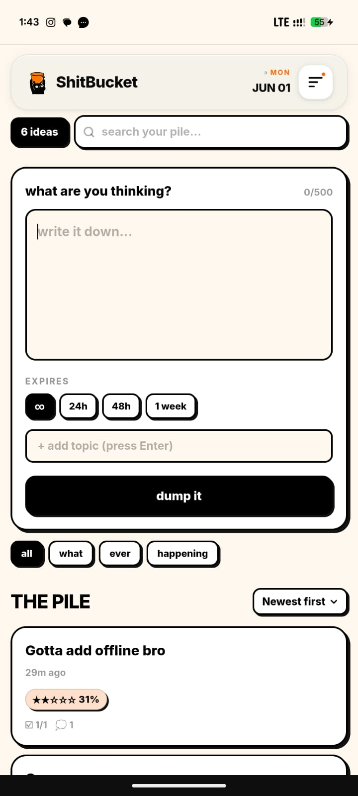
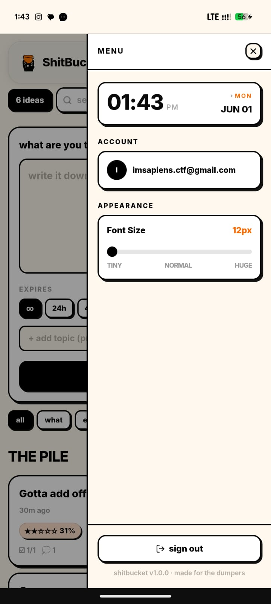
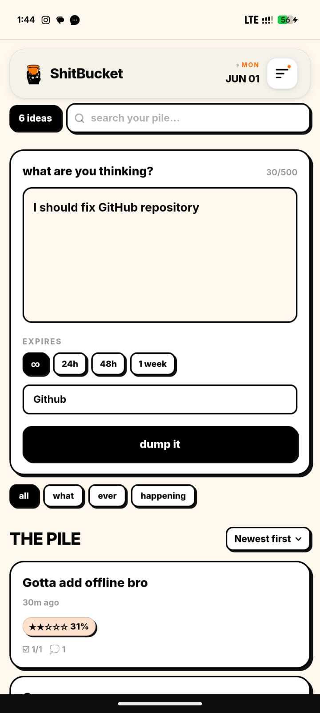
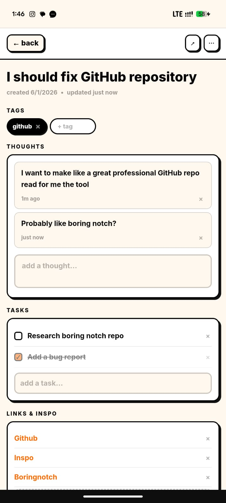
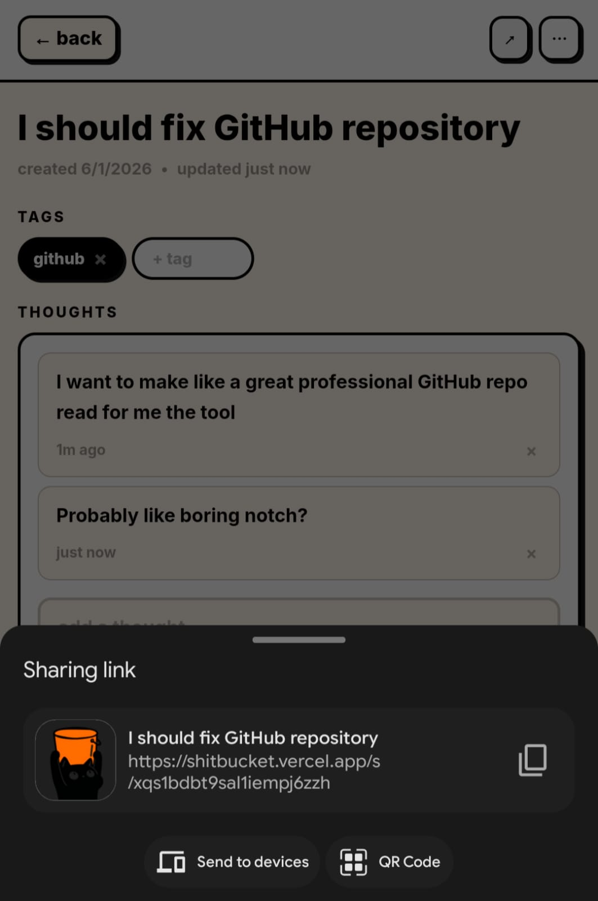

# 🪣 ShitBucket

> **Dump your ideas. Brew them over time.**

[](https://opensource.org/licenses/MIT)
[](https://nextjs.org/)
[](https://supabase.com/)

**ShitBucket** is a brutalist, mobile-first idea capture tool designed for the "dump and brew" workflow. It's not a note-taking app; it's a refinery for your rawest thoughts.

[**Live Demo**](https://shitbucket.vercel.app) (Placeholder) | [**Bug Report**](https://github.com/randomsapiens1/shitbucket/issues)

---

## 📸 Showcase

| The Pile (List) | Brewing Progress (Detail) | Quick Dump |
| :---: | :---: | :---: |
|  |  |  |

| Collaborative Sharing | Mobile First Design |
| :---: | :---: |
|  |  |

---

## 🧠 The Philosophy: Dump & Brew

Most ideas start as "shit." They are raw, messy, and incomplete. ShitBucket encourages you to:

1.  **Dump:** Get it out of your head in under 5 seconds.
2.  **Brew:** Let it sit. Add thoughts, tasks, and links over time.
3.  **Gold:** Watch the "Brew Progress" bar move from **Raw** to **Gold** as your idea matures.

---

## 🧪 The Brewing Algorithm

ShitBucket uses a deterministic scoring system (0–100%) to track the maturity of an idea:

-   **Description:** +10 points for a main thought.
-   **Notes:** +6 points per sub-thought (up to 30).
-   **Tags & Links:** +10 points each if present.
-   **Fields:** +5 points per custom field (up to 15).
-   **Tasks:** +10 points for having tasks + up to 15 points for completion ratio.

---

## 🛠️ Tech Stack

-   **Frontend:** Next.js 16 (App Router), React 18, Tailwind CSS
-   **Backend:** Supabase (Auth, PostgreSQL, RLS)
-   **PWA:** Service Workers for offline-first capabilities
-   **Mobile:** Capacitor for native iOS/Android wrapping

---

## 🚀 One-Click Setup

### 1. Supabase Backend
1. Create a project at [Supabase](https://supabase.com).
2. Run the `supabase-schema.sql` in the SQL Editor.
3. Copy your `Project URL` and `Anon Key`.

### 2. Local Development
```bash
git clone https://github.com/randomsapiens1/shitbucket.git
cd shitbucket
npm install
cp .env.local.example .env.local
```
Fill in your `.env.local` and run:
```bash
npm run dev
```

---

## 🤝 Contributing

We love contributions! Whether it's a bug fix, a new "Brew" metric, or a CSS tweak to make the shadows even harder, check out our [Contributing Guidelines](CONTRIBUTING.md).

## 📄 License

Distributed under the MIT License. See `LICENSE` for more information.

---

*Built with 🧡 by [Raj Kumar](https://github.com/randomsapiens1) • [rajkumaryhere@gmail.com](mailto:rajkumaryhere@gmail.com)*
